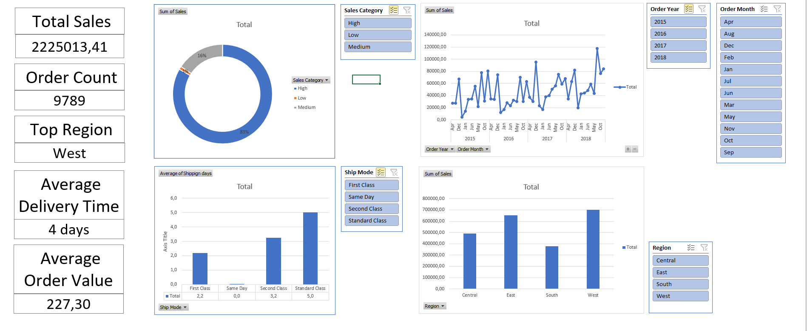

## Excel Sales Data Analysis Project

Dataset: Global Superstore dataset (9800 records)

Dataset source: https://www.kaggle.com/datasets/rohitsahoo/sales-forecasting

##  Project Overview
The goal of this project is to identify sales trends by cleaning the dataset, performing analysis, and creating an interactive dashboard with key metrics.

### Tools Used
- Microsoft Excel
- Pivot Tables
- Data Cleaning
- Dashboard Design

### 1. Data Cleaning

- Checked the dataset for duplicate records (none found)
- Removed rows with missing Postal Code values (11 rows)
- Verified categorical fields (Segment,Region,Category)
- Checked Order Date and Ship Date columns for correct format
- Ensured that sales values are positive
- Standardized numeric format in the Sales column
- Created a "Shipping days" column to validate delivery time

Ensured the dataset was consistent before starting the analysis.

### 2. Data Transformation

- Created Order Year,Quarter,Month columns
These columns allow sales performance to be analyzed over time

- Created Sales Category, divided into Low, Medium and High segments using the PERCENTILE.INC

### 3. Data Analysis

Created 5 pivot tables:
- Count of orders by category
- Sum of sales by Region
- Sum of sales by Year and Month
- Average delivery time by Shipping mode
- Total order count

Also Calculated Average Order Value

### 4. Dashboard

An interactive Excel dashboard was created to summarize key insights.

The dashboard includes five key metrics:
- Total Sales
- Order Count
- Top Performing Region
- Average Delivery Time
- Average Order Value

The dashboard also includes four charts:
- Orders by Category
- Sales by Region
- Monthly Sales Trend
- Average Shipping Time by Shipping Mode

Interactive slicers were added to allow filtering the dashboard by key categories.

### Dashboard Preview

## Conclusion
The analysis provides insights into regional sales performance, order distribution across product categories, delivery efficiency across shipping modes, and time trends.

The dashboard provides quick access to key metrics and helps identify important sales patterns.

